<div align="center">
  <br />
  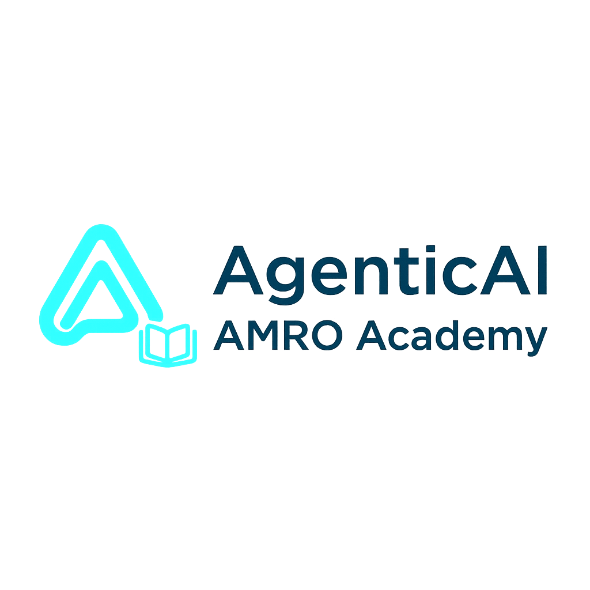
  <br />
  <br />

  <div>
    
    
    
    
    
  </div>

  <h3 align="center">AMRO AI Academy - Revolutionary Voice-First Learning Platform</h3>

  <p align="center">
    Experience personalized learning through interactive voice conversations with AI companions
  </p>
</div>

## 📋 Table of Contents

1. [Overview](#overview)
2. [Key Features](#key-features)
3. [Application Architecture](#application-architecture)
4. [Badge System](#badge-system)
5. [Certificate System](#certificate-system)
6. [Tech Stack](#tech-stack)
7. [Getting Started](#getting-started)
8. [Project Structure](#project-structure)
9. [Environment Variables](#environment-variables)
10. [Features in Detail](#features-in-detail)
11. [Contributing](#contributing)

## 🎯 Overview

AMRO AI Academy is a cutting-edge Learning Management System (LMS) that revolutionizes education through AI-powered voice companions. The platform enables users to create, interact with, and learn from personalized AI tutors using advanced voice technology.

<div align="center">
  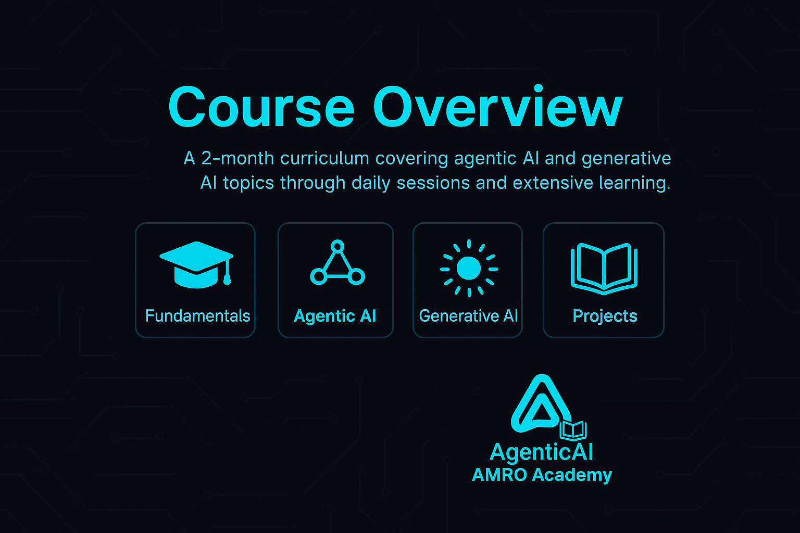
  <p><em>Platform Overview - Experience the future of personalized learning</em></p>
</div>

The platform combines the power of artificial intelligence with natural voice interactions, creating an immersive learning experience that adapts to each user's unique learning style and preferences.

<div align="center">
  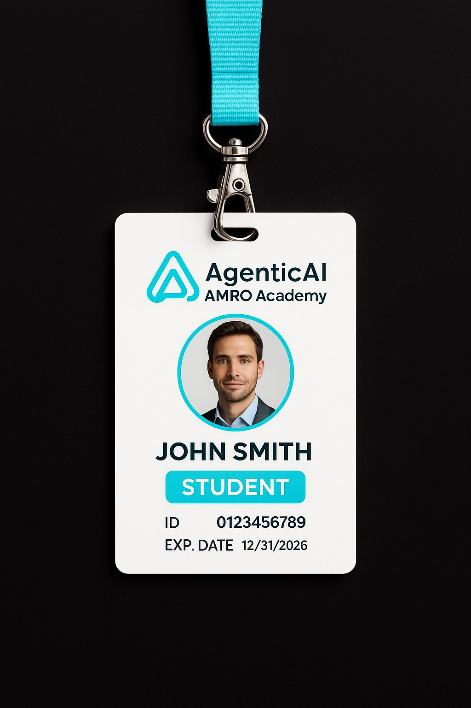
  <p><em>Your digital learning identity in the AMRO AI Academy ecosystem</em></p>
</div>

## ✨ Key Features

### 🤖 AI Voice Companions
Create custom AI learning companions that specialize in various subjects. Engage in natural voice conversations for an immersive learning experience.

### 🎓 Comprehensive Learning System
- **Subject Diversity**: Learn across multiple domains including Agentic AI, Machine Learning, Data Science, Python Programming, Neural Networks, NLP, Computer Vision, and more
- **Personalized Sessions**: Each learning session is tailored to your progress and learning style
- **Session History**: Track all your learning sessions with detailed history

### 🏆 Achievement & Recognition

#### Badge System
Earn badges as you progress through your learning journey:

<div align="center">
  <table>
    <tr>
      <td align="center">
        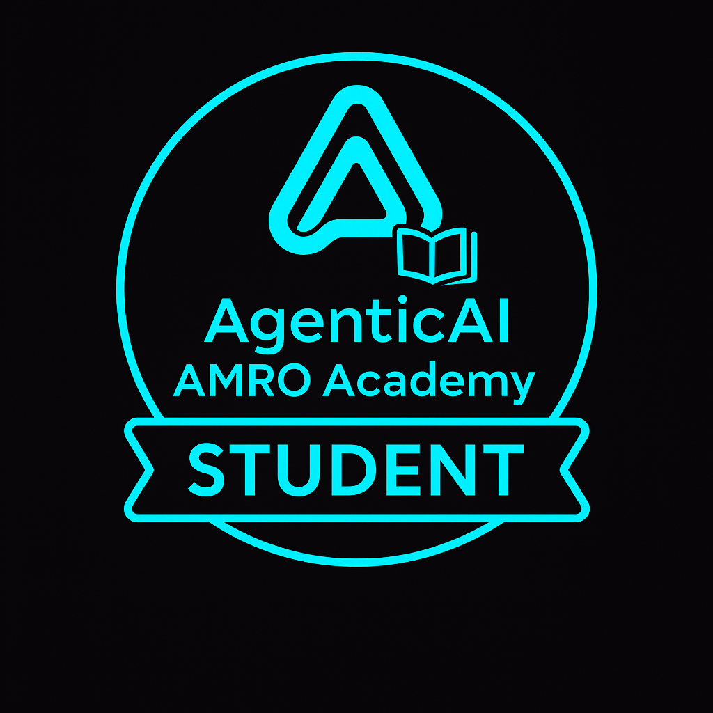
        <br /><strong>Student Badge</strong>
        <br />Awarded to all new learners
      </td>
      <td align="center">
        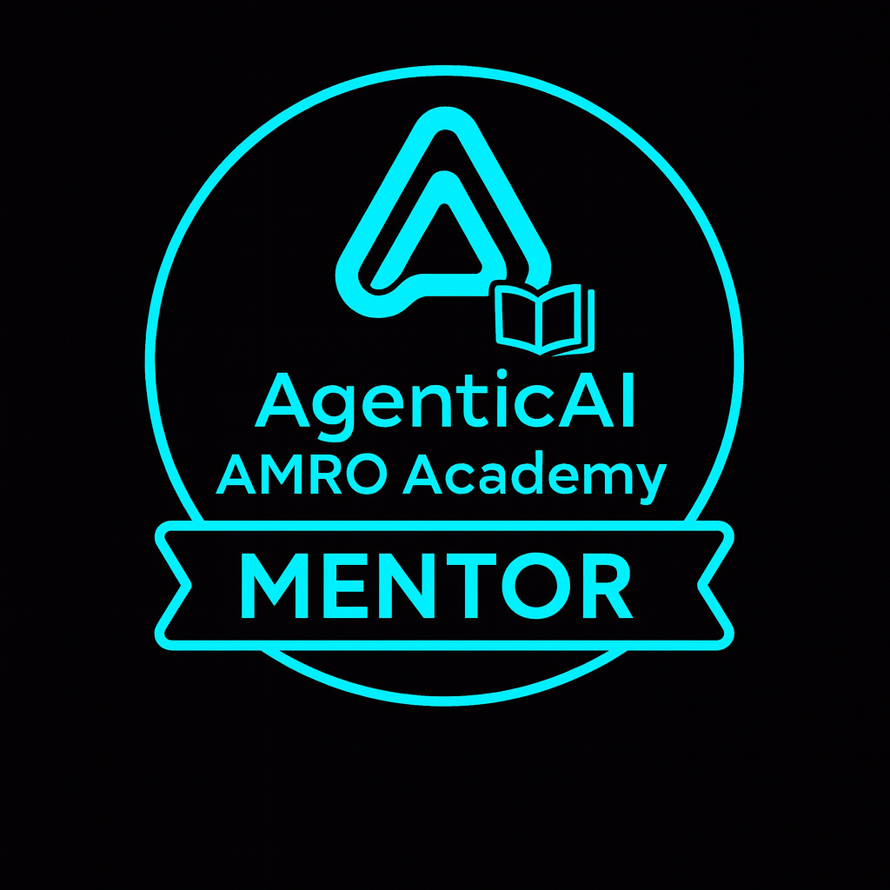
        <br /><strong>Mentor Badge</strong>
        <br />Create 5+ companions
      </td>
      <td align="center">
        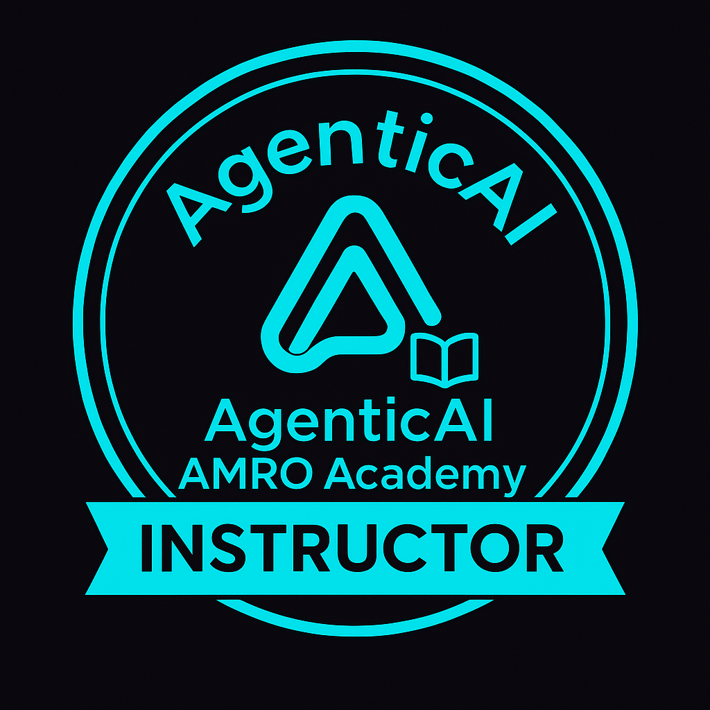
        <br /><strong>Instructor Badge</strong>
        <br />Create 10+ companions & complete 20+ sessions
      </td>
    </tr>
    <tr>
      <td align="center">
        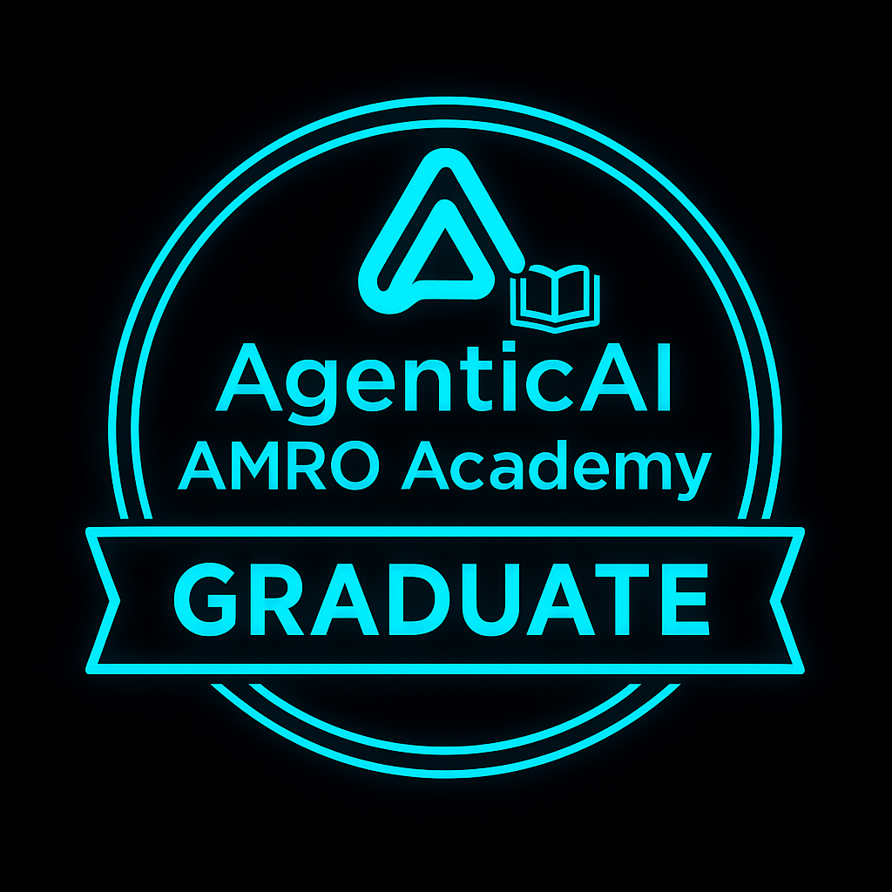
        <br /><strong>Graduate Badge</strong>
        <br />Complete significant milestones
      </td>
      <td align="center">
        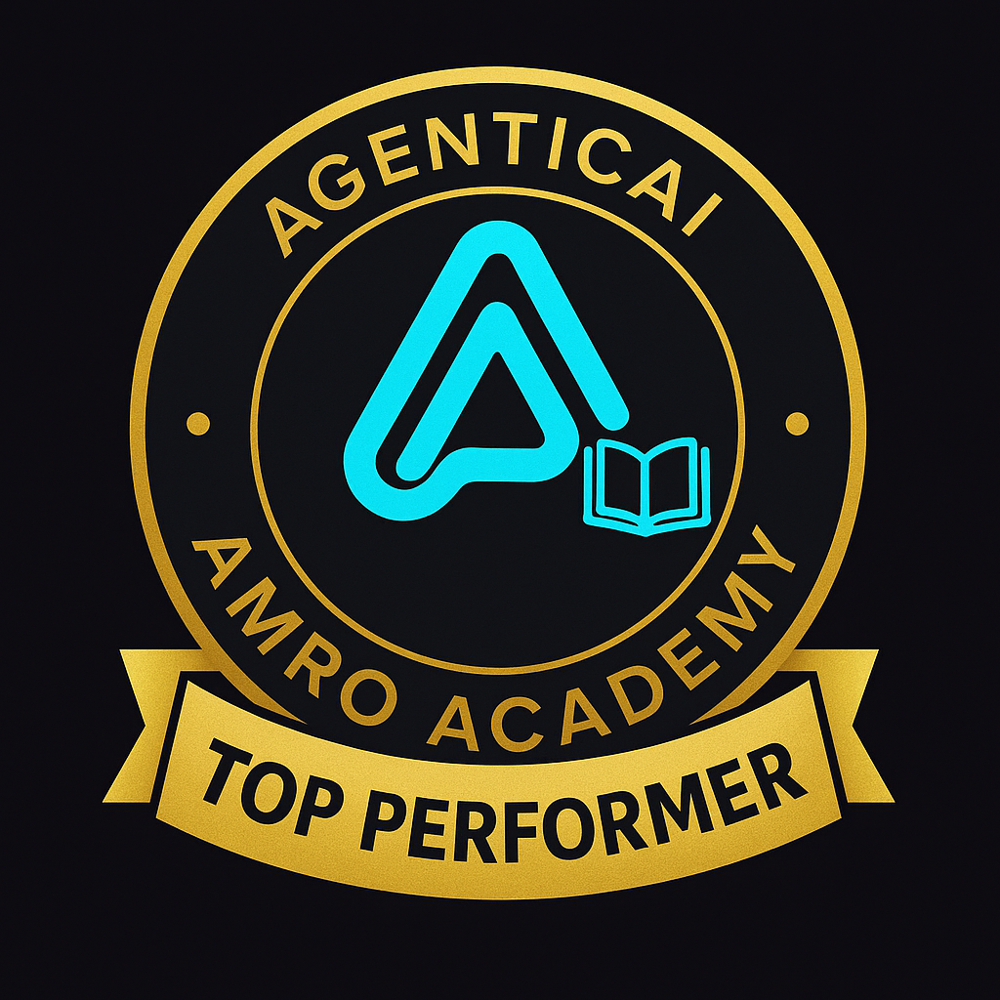
        <br /><strong>Top Performer Badge</strong>
        <br />Excellence in learning achievements
      </td>
    </tr>
  </table>
</div>

#### Certificate System
Earn verifiable certificates for your learning achievements:

<div align="center">
  <table>
    <tr>
      <td align="center">
        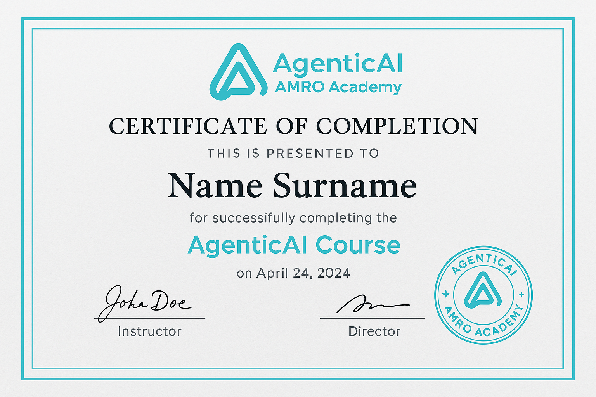
        <br /><strong>Course Completion Certificate</strong>
        <br />Earned upon completing courses
      </td>
      <td align="center">
        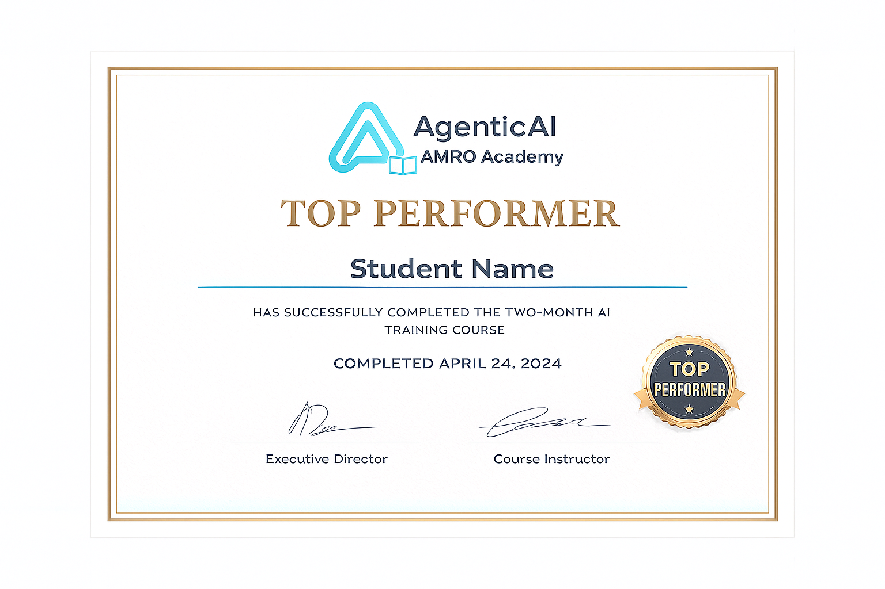
        <br /><strong>Top Performer Certificate</strong>
        <br />Recognition for exceptional performance
      </td>
    </tr>
  </table>
</div>

### 🔐 Authentication & User Management
- Secure authentication powered by Clerk
- User profiles with detailed learning statistics
- Subscription management for premium features
- Social login options (Google, etc.)

### 📚 Learning Library
- Browse and search through a vast library of AI companions
- Filter by subject and topic
- Bookmark favorite companions for quick access
- Discover popular and trending learning companions

### 🔄 Integrations

<div align="center">
  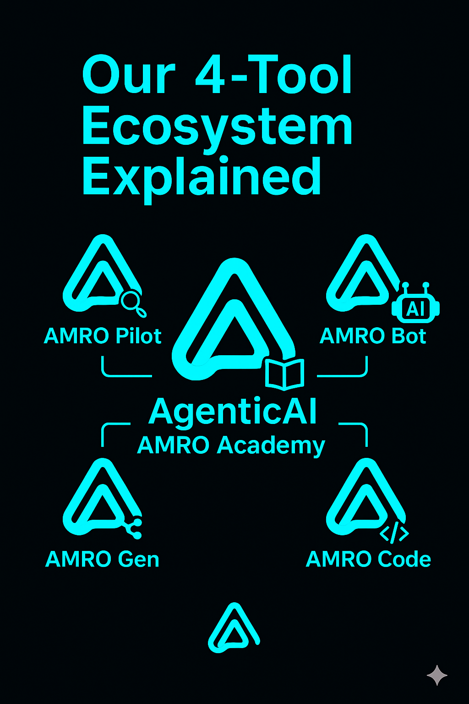
  <p><em>Seamless integrations with leading platforms and services</em></p>
</div>

The platform integrates with:
- **Vapi**: Advanced voice AI for natural conversations
- **Supabase**: Robust backend and database infrastructure
- **Clerk**: Comprehensive authentication and user management
- **Next.js**: Modern web framework for optimal performance

## 🏗️ Application Architecture

AMRO AI Academy is built with a modern, scalable architecture:

- **Frontend**: Next.js 15 with React 19, TypeScript, and Tailwind CSS
- **Backend**: Server Actions with Next.js API routes
- **Database**: Google Cloud SQL (PostgreSQL 17)
- **Authentication**: Clerk
- **Voice AI**: Vapi
- **Deployment**: Google Cloud Run (Docker)
- **UI Components**: shadcn/ui with Radix UI primitives
- **State Management**: React Server Components
- **Styling**: Tailwind CSS with custom design system

## 🏆 Badge System

The badge system rewards learners for their engagement and achievements:

| Badge | Requirement | Description |
|-------|------------|-------------|
| **Student** | Account Creation | Automatically awarded when you join |
| **Mentor** | 5+ Companions Created | Recognize your contribution to the learning community |
| **Instructor** | 10+ Companions & 20+ Sessions | Advanced recognition for dedicated educators |
| **Graduate** | Learning Milestones | Achievement for significant learning progress |
| **Top Performer** | Excellence Criteria | Recognition for outstanding performance |

Badges are displayed prominently in your profile and serve as a testament to your learning journey and contributions to the community.

## 📜 Certificate System

Certificates provide verifiable proof of your learning achievements:

- **Course Completion Certificates**: Earned when you complete courses or significant learning sessions
- **Top Performer Certificates**: Awarded for exceptional learning performance
- **Unique Certificate Numbers**: Each certificate includes a unique identifier for verification
- **Digital Verification**: All certificates are digitally verifiable through the platform

Certificates are stored securely and can be accessed anytime from your profile page.

## ⚙️ Tech Stack

### Core Technologies

- **[Next.js 15](https://nextjs.org/)**: React framework with App Router, Server Components, and API routes
- **[TypeScript](https://www.typescriptlang.org/)**: Type-safe development for better code quality
- **[React 19](https://react.dev/)**: Latest React features for optimal user experience
- **[Tailwind CSS](https://tailwindcss.com/)**: Utility-first CSS framework for rapid UI development

### Backend & Database

- **[Supabase](https://supabase.com/)**: Open-source Firebase alternative with PostgreSQL database
  - Real-time subscriptions
  - Authentication
  - Storage
  - Row Level Security (RLS)

### Authentication & Payments

- **[Clerk](https://clerk.com/)**: Complete authentication and user management solution
  - Multi-factor authentication
  - Social logins
  - User management
  - Subscription management

### AI & Voice

- **[Vapi](https://www.vapi.ai/)**: Voice AI platform for conversational interactions
  - Low-latency voice interactions
  - Speech-to-text and text-to-speech
  - Customizable voices
  - Multi-language support

### UI Components

- **[shadcn/ui](https://ui.shadcn.com/)**: High-quality, accessible component library
- **[Radix UI](https://www.radix-ui.com/)**: Unstyled, accessible component primitives
- **[Lucide React](https://lucide.dev/)**: Beautiful icon library
- **[Framer Motion](https://www.framer.com/motion/)**: Animation library for smooth interactions

### Development Tools

- **[Zod](https://zod.dev/)**: TypeScript-first schema validation
- **[React Hook Form](https://react-hook-form.com/)**: Performant forms with easy validation
- **[ESLint](https://eslint.org/)**: Code linting and quality assurance

## 🚀 Getting Started

### Prerequisites

Make sure you have the following installed on your machine:

- [Node.js](https://nodejs.org/) (v18 or higher)
- [npm](https://www.npmjs.com/) or [yarn](https://yarnpkg.com/)
- [Git](https://git-scm.com/)

### Installation

1. **Clone the repository**

```bash
git clone <repository-url>
cd amroacademy
```

2. **Install dependencies**

```bash
npm install
```

3. **Set up environment variables**

Create a `.env.local` file in the root directory and add the following variables:

```env
# Clerk Authentication
NEXT_PUBLIC_CLERK_PUBLISHABLE_KEY=your_clerk_publishable_key
CLERK_SECRET_KEY=your_clerk_secret_key
NEXT_PUBLIC_CLERK_SIGN_IN_URL=/sign-in
NEXT_PUBLIC_CLERK_SIGN_IN_FALLBACK_REDIRECT_URL=/
NEXT_PUBLIC_CLERK_SIGN_UP_FALLBACK_REDIRECT_URL=/

# Supabase
NEXT_PUBLIC_SUPABASE_URL=your_supabase_url
NEXT_PUBLIC_SUPABASE_ANON_KEY=your_supabase_anon_key
SUPABASE_SERVICE_ROLE_KEY=your_supabase_service_role_key

# Vapi
NEXT_PUBLIC_VAPI_WEB_TOKEN=your_vapi_web_token

# Sentry (Optional - for error tracking)
SENTRY_AUTH_TOKEN=your_sentry_auth_token
```

4. **Set up the database**

Run the Supabase migration scripts to set up your database schema:

```bash
# Execute the SQL files in your Supabase dashboard or using the CLI
# supabase-migration.sql
# supabase-setup.sql
```

5. **Run the development server**

```bash
npm run dev
```

6. **Open your browser**

Navigate to [http://localhost:3000](http://localhost:3000) to see the application.

## 📁 Project Structure

```
amroacademy/
├── app/                          # Next.js App Router directory
│   ├── api/                     # API routes
│   ├── companions/              # Companions pages
│   │   ├── [id]/               # Individual companion page
│   │   ├── new/                # Create new companion
│   │   └── page.tsx            # Companions library
│   ├── my-journey/             # User profile/journey page
│   ├── certificates/           # Certificate pages
│   ├── subscription/           # Subscription management
│   ├── sign-in/               # Authentication pages
│   ├── layout.tsx             # Root layout
│   ├── page.tsx               # Home page
│   └── globals.css            # Global styles
├── components/                  # React components
│   ├── ui/                    # shadcn/ui components
│   ├── CompanionCard.tsx      # Companion card component
│   ├── CompanionForm.tsx      # Create/edit companion form
│   ├── BadgeDisplay.tsx       # Badge display component
│   ├── Certificate.tsx        # Certificate component
│   └── ...
├── lib/                        # Utility functions and server actions
│   ├── actions/               # Server actions
│   │   ├── companion.actions.ts
│   │   ├── badge.actions.ts
│   │   └── certificate.actions.ts
│   ├── supabase.ts           # Supabase client
│   ├── utils.ts              # Utility functions
│   └── vapi.sdk.ts           # Vapi SDK integration
├── constants/                  # Application constants
│   ├── index.ts              # Subject and voice constants
│   └── soundwaves.json       # Sound wave configurations
├── types/                      # TypeScript type definitions
├── public/                     # Static assets
│   ├── images/
│   │   └── amro-ai-academy/  # Academy images
│   └── icons/                 # Icon files
├── middleware.ts              # Next.js middleware
└── package.json              # Dependencies and scripts
```

## 🔐 Environment Variables

### Required Variables

| Variable | Description | Where to Get It |
|----------|-------------|-----------------|
| `NEXT_PUBLIC_CLERK_PUBLISHABLE_KEY` | Clerk publishable key | [Clerk Dashboard](https://dashboard.clerk.com) |
| `CLERK_SECRET_KEY` | Clerk secret key | [Clerk Dashboard](https://dashboard.clerk.com) |
| `NEXT_PUBLIC_SUPABASE_URL` | Supabase project URL | [Supabase Dashboard](https://supabase.com/dashboard) |
| `NEXT_PUBLIC_SUPABASE_ANON_KEY` | Supabase anonymous key | [Supabase Dashboard](https://supabase.com/dashboard) |
| `SUPABASE_SERVICE_ROLE_KEY` | Supabase service role key | [Supabase Dashboard](https://supabase.com/dashboard) |
| `NEXT_PUBLIC_VAPI_WEB_TOKEN` | Vapi web token | [Vapi Dashboard](https://dashboard.vapi.ai) |

### Optional Variables

| Variable | Description |
|----------|-------------|
| `SENTRY_AUTH_TOKEN` | Sentry authentication token for error tracking |

## 📖 Features in Detail

### Creating AI Companions

1. Navigate to the "Create Companion" page
2. Fill in the companion details:
   - Name and description
   - Subject (Agentic AI, Machine Learning, etc.)
   - Topic
   - Learning style (formal/casual)
   - Voice preferences (male/female)
3. Save and start learning immediately

### Learning Sessions

- Start voice conversations with any AI companion
- Sessions are automatically tracked
- View session history in your profile
- Bookmark companions for quick access

### Badge Progression

Badges are automatically awarded based on your activity:
- **Student**: Automatically on signup
- **Mentor**: Create 5+ companions
- **Instructor**: Create 10+ companions AND complete 20+ sessions
- **Graduate & Top Performer**: Earned through special achievements

### Certificate Generation

Certificates are generated automatically when you:
- Complete significant learning milestones
- Achieve top performance in courses
- Meet specific learning criteria

Each certificate includes:
- Unique certificate number
- Completion date
- Course/subject name
- Digital verification

### User Profile

Your profile page (My Journey) displays:
- Learning statistics (sessions completed, companions created)
- All earned badges
- Certificate collection
- Bookmarked companions
- Recent learning sessions
- Created companions

## 🤝 Contributing

We welcome contributions to AMRO AI Academy! Here are some ways you can help:

1. **Report Bugs**: If you find a bug, please open an issue on GitHub
2. **Suggest Features**: Share your ideas for new features
3. **Submit Pull Requests**: Contribute code improvements
4. **Improve Documentation**: Help us make the docs better
5. **Share Feedback**: Your feedback helps us improve

### Development Guidelines

- Follow TypeScript best practices
- Use ESLint for code quality
- Write meaningful commit messages
- Test your changes before submitting
- Follow the existing code style

## 📝 License

This project is private and proprietary. All rights reserved.

## 🙏 Acknowledgments

- **Vapi** for powerful voice AI capabilities
- **Clerk** for seamless authentication
- **Supabase** for robust backend infrastructure
- **Next.js Team** for the amazing framework
- **shadcn** for beautiful UI components
- All contributors and users of AMRO AI Academy

---

<div align="center">
  <p>Built with ❤️ by the AMRO AI Academy Team</p>
  <p>
    <a href="#-overview">Back to Top</a>
  </p>
</div>
